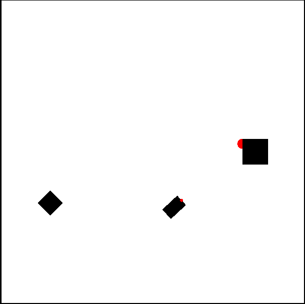

# OpenAI Gym Ultrasonic robot sensor environment


[](https://coveralls.io/github/dizcza/gym-ultrasonic?branch=master)




### Environment
`UltrasonicServo-v0` (`AutonomousRobot-v1` in the [original repo](https://github.com/lelmac/robotsim)) - Ultrasonic sensor (without moving servo for now), mounted on top of a robot (small red circle), heads forward.

## Setup
```bash
pip install -r requirements.txt
python ddpg.py
```
